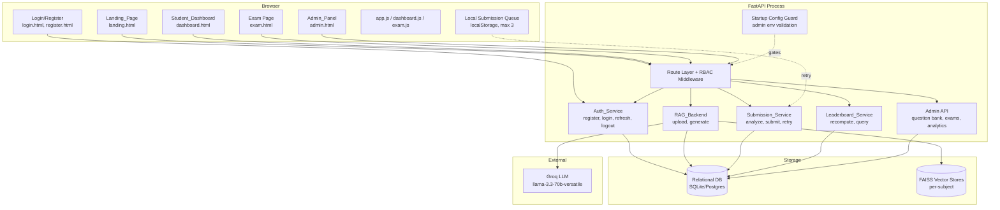
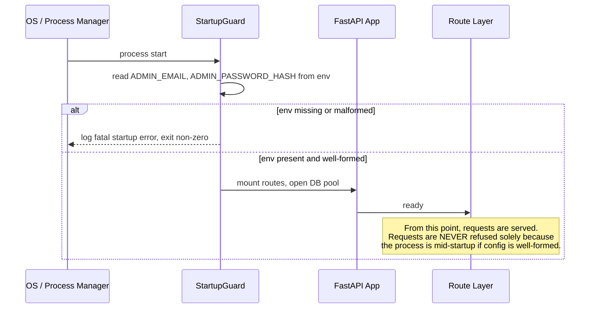
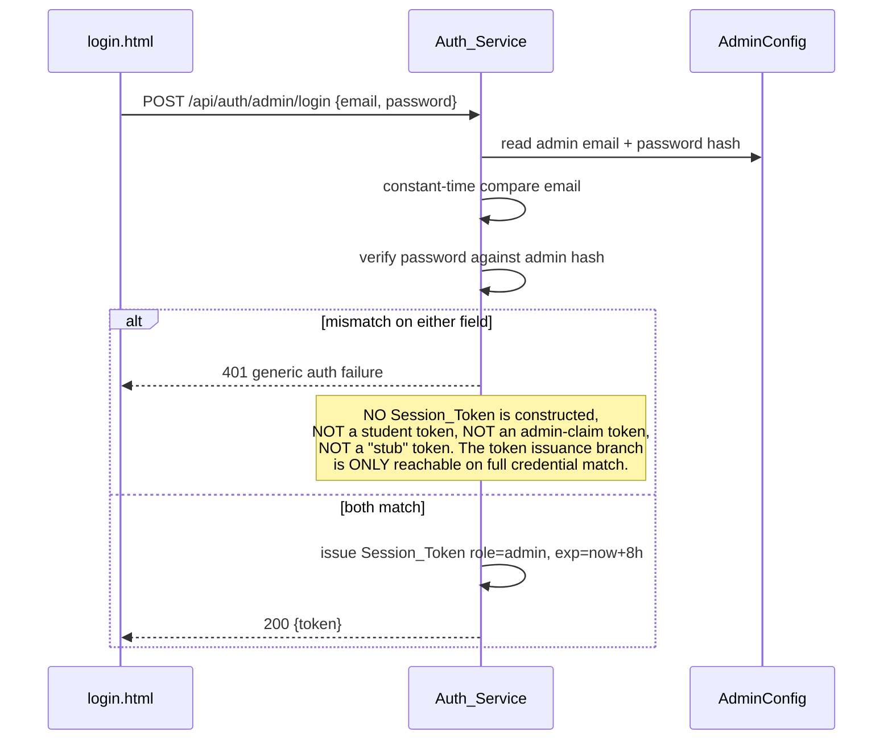
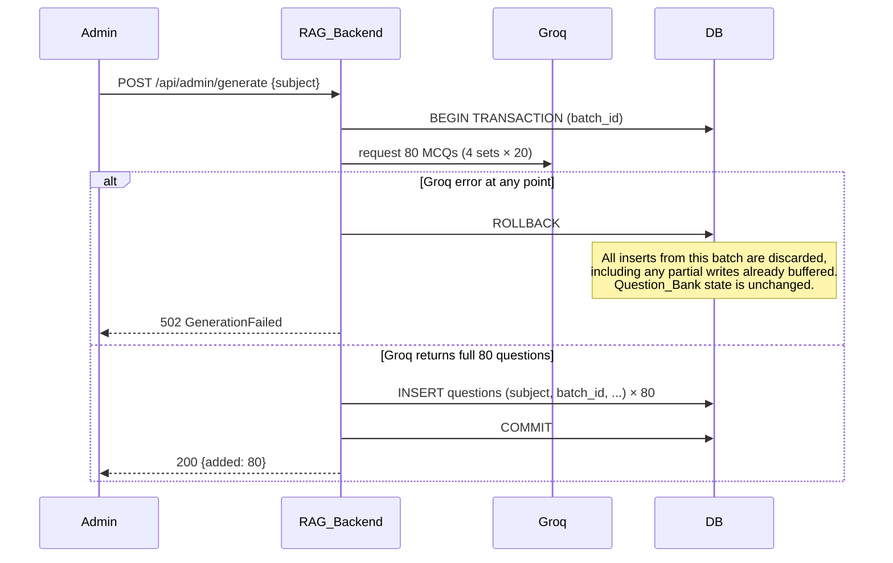
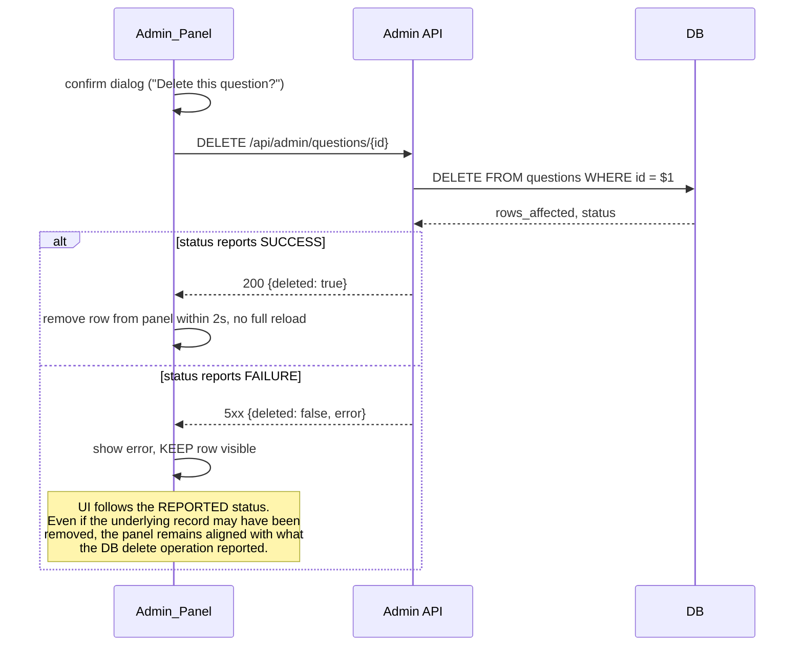
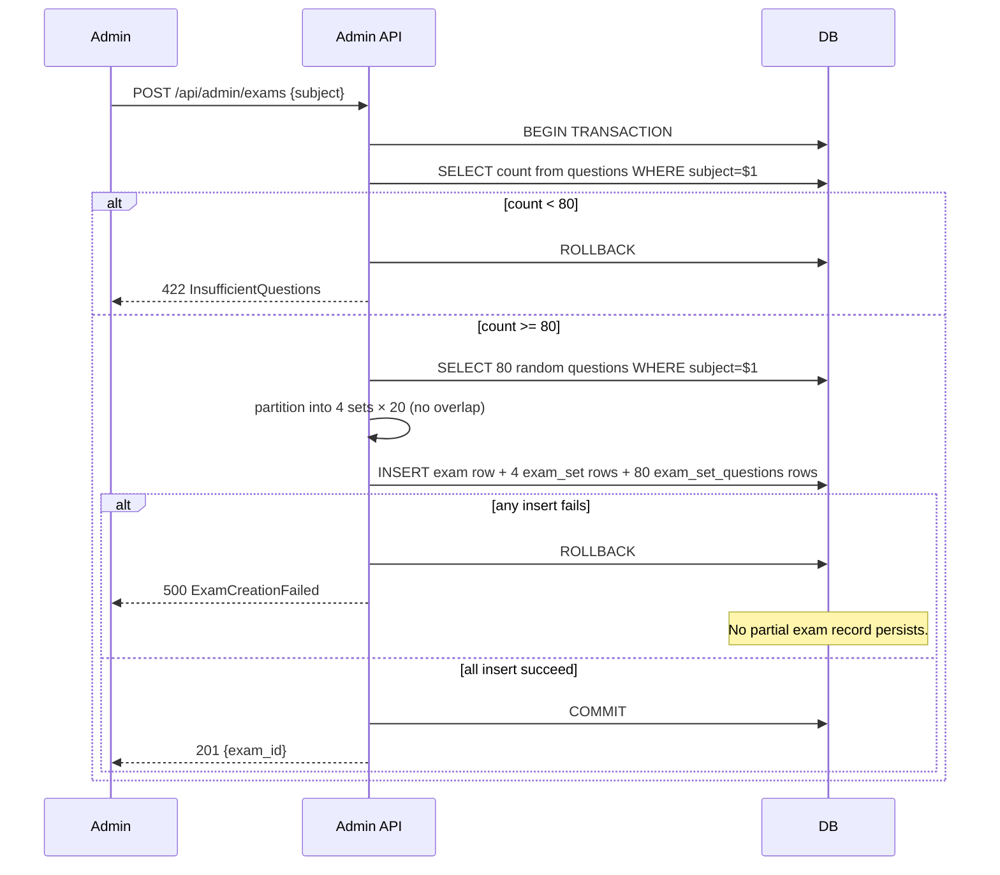
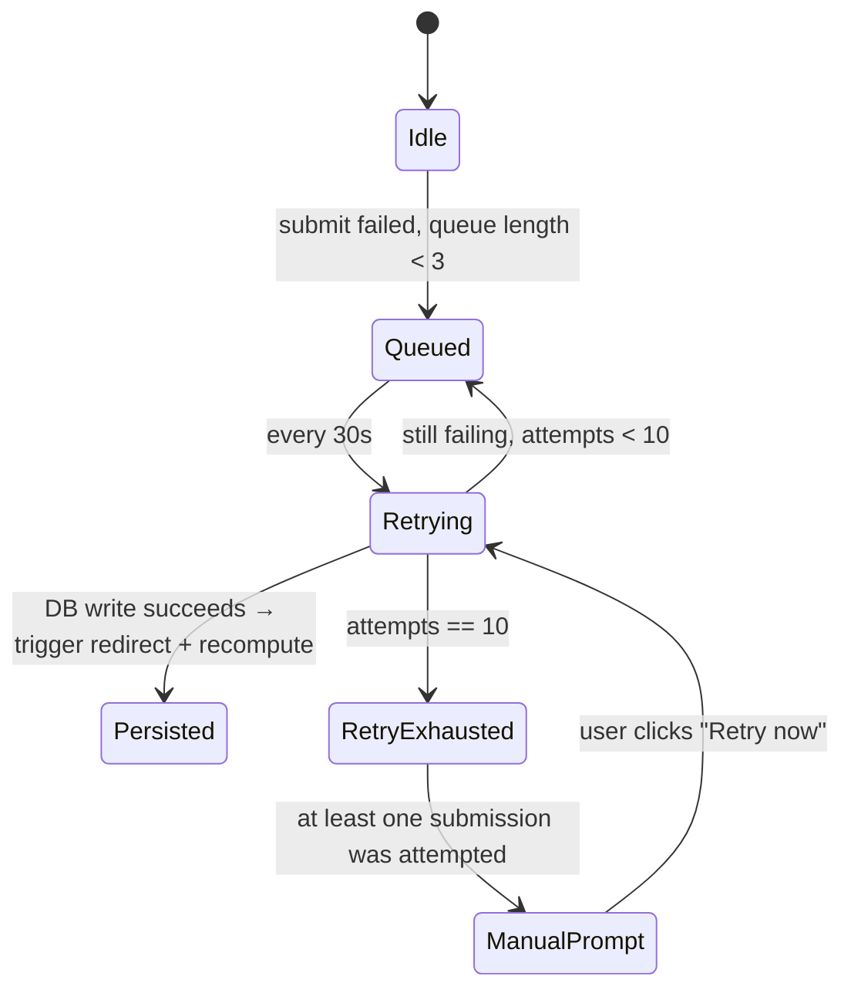

# Design Document — SmartKCET Platform Upgrade

## Overview

This design upgrades the existing single-user, Biology-only ExamForge AI generator into a multi-subject KCET preparation platform with student authentication, an admin control panel, persistent storage, a leaderboard, and subject-wise analytics. It preserves the existing visual design (style.css, navbar, KPI tiles, charts) and the existing RAG generation pipeline (FAISS + Groq), while introducing role-based access control, a relational database, and new pages for landing, login, register, admin panel, and exams.

The design is organised around three backend services running inside the same FastAPI process (`Auth_Service`, `RAG_Backend`, `Submission_Service`) plus the existing static frontend, all backed by a single relational database (SQLite for development, PostgreSQL-compatible schema for production). All persistent state moves out of `localStorage` into the database; `localStorage` is retained only for active-session UI state and an offline submission queue.

Key design intents driven by the refined requirements:

- Registration short-circuits on duplicate email **before** any password hashing work is performed (REQ-1.2).
- Failed admin authentication produces no token of any kind, with no shared code path that could leak a student-role token on admin-credential failure (REQ-3.2).
- Startup-blocking on misconfiguration is scoped strictly to the admin configuration; well-formed configs do not delay request serving (REQ-3.5).
- Admin-only UI elements (upload, generate, question-bank management) are never rendered for student sessions and never delivered to unauthenticated visitors except behind admin-restricted routes that themselves require an admin token to load (REQ-4.4).
- Question generation runs inside a single transactional batch — either all writes commit, or all writes are rolled back on Groq error (REQ-5.5).
- Question deletion in the admin panel follows the DB delete operation's *reported* status, not an inferred state (REQ-6.2).
- Exam creation (draw 80, partition into 4 sets, persist) is a single atomic transaction (REQ-7.1).
- Submission persistence supports retry-then-redirect — if `analyze` initially errors but a retry succeeds, the dashboard redirect still fires (REQ-9.5).
- Leaderboard scoring tolerates empty cohorts via a fallback normalisation factor of 1 (REQ-11.1) and excludes students below a 30% minimum-score threshold (REQ-11.2 / REQ-10.2).
- Leaderboard recomputation only fires after a fully successful submission (REQ-11.6).
- Manual retry prompt only renders after at least one queued submission has actually been attempted and the retry limit is exhausted (REQ-14.7).
- A build-time CSS-link check enforces `style.css` linkage on **all** pages — new and existing (REQ-15.5).
- The landing page CSS is loosened to follow best practices (no inline colours/fonts, no overriding class definitions); it is not required to consume specific custom properties (REQ-13.3).

## Architecture

### High-Level Component Diagram



### Process Boundaries and Trust Zones

| Zone | Components | Trust |
|------|-----------|-------|
| Public | Landing_Page, login, register | No auth required |
| Student | Student_Dashboard, exam.html, exam APIs | Requires student `Session_Token` |
| Admin | Admin_Panel, upload, generate, question bank, analytics | Requires admin `Session_Token` |
| Server-only | DB, FAISS, Groq client, secrets | Never reachable from the browser |

### Routing and Static Asset Layout

```
/                     → Landing_Page (unauthenticated)
                        - Authenticated student → 302 → /dashboard
                        - Authenticated admin   → 302 → /admin
/login                → login.html
/register             → register.html
/dashboard            → Student_Dashboard (student token required)
/exam                 → exam.html (student token required)
/admin                → Admin_Panel root (admin token required)
/admin/upload         → existing index.html generator UI, moved here
/admin/questions      → Question_Bank management
/admin/exams          → Exam creation & publish/unpublish
/admin/analytics      → Aggregate analytics
```

The historical `index.html` generator UI is relocated to `/admin/upload` so that the public root path can host the new `Landing_Page` (REQ-13.5).

### Startup Sequence (REQ-3.5)



The startup guard runs **once** before the HTTP server begins accepting connections. After it passes, the application accepts requests immediately. It does not impose an additional "warm-up" gate on per-request handling, satisfying the REQ-3.5 clarification that requests must not be refused merely because startup is in progress.

## Components and Interfaces

### 1. Auth_Service

Responsible for registration, login (student and admin), session token issuance, role enforcement helpers, and lockouts.

#### 1.1 Registration Flow (REQ-1.2 — duplicate-check before hashing)

```mermaid
sequenceDiagram
    participant Client as register.html
    participant Auth as Auth_Service
    participant DB

    Client->>Auth: POST /api/auth/register {email, password, display_name}
    Auth->>Auth: validate email RFC5322, length, password rules, name length
    alt validation fails
        Auth-->>Client: 400 ValidationError (no DB call, no hashing)
    else validation passes
        Auth->>DB: SELECT 1 FROM users WHERE email = $1
        alt email already exists
            Auth-->>Client: 409 EmailAlreadyRegistered
            Note over Auth: Hash routine is NOT invoked.
        else email is free
            Auth->>Auth: hash password (bcrypt/argon2)
            Auth->>DB: INSERT user; assign next KCET_Student_ID inside same tx
            DB-->>Auth: kcet_id
            Auth-->>Client: 201 Created {kcet_student_id}
        end
    end
```

The duplicate-check happens before the hashing routine. The hashing call sits behind the `email_exists` branch and is reachable only on the false branch. This is enforced both at the code level (single function with explicit early return) and verified by a property test that asserts the hash function is not called when the email is a duplicate.

#### 1.2 Student Login Flow

Standard email/password validation, with per-account failed-attempt counter (5 attempts → 15-minute lockout, REQ-2.6). On success, issues a JWT-style `Session_Token` with claims `{sub: kcet_id, role: "student", exp: now+24h}`.

#### 1.3 Admin Login Flow (REQ-3.2 — no token on failure, ever)



Implementation rule: the admin login handler has exactly one `issue_token(...)` call site and it is gated on the boolean result of credential verification. There is no fallback "issue student token instead" path on admin auth failure.

#### 1.4 Session_Token Format and Storage

| Aspect | Choice |
|--------|--------|
| Format | JWT (HS256 or asymmetric in production) |
| Claims | `sub`, `role`, `iat`, `exp`, `jti` |
| Student lifetime | ≤ 24h (REQ-2.5) |
| Admin lifetime | ≤ 8h (REQ-3.1) |
| Browser storage | `httpOnly` cookie (NOT `localStorage`, REQ-14.5) |
| Revocation | `jti` blacklist on logout (REQ-2.7) |

#### 1.5 Failed-Login Counter and Lockout Reset (REQ-2.6)

The `users.failed_login_count` and `users.lockout_until` columns are managed as follows:

| Event | Effect on `failed_login_count` | Effect on `lockout_until` |
|-------|-------------------------------|---------------------------|
| Failed login (within window) | increment by 1 | unchanged until count reaches 5 |
| 5th consecutive failure | set to 5 | `now() + 15 minutes` |
| Failed login while locked | not incremented | unchanged (lockout response) |
| Successful login | reset to 0 | reset to NULL |
| Lockout window elapses naturally | reset to 0 on next login attempt | reset to NULL |

The lockout response carries the remaining wait time in seconds (`Retry-After` header and JSON `retry_after_sec`), satisfying REQ-2.6's "remaining wait time" wording.

#### 1.6 RBAC Middleware (REQ-4)

A single middleware reads the `Session_Token` cookie on every protected request and resolves the user role:

| Token state | Result |
|------------|--------|
| Missing on protected endpoint | 401 |
| Malformed/expired on protected endpoint | 401 |
| Student role on admin endpoint | 403 (no body data) |
| Student requesting another student's data | 403 |
| Admin role on admin endpoint | proceed |
| Student role on student endpoint | proceed |

### 2. RAG_Backend (existing, extended)

The existing FAISS + Groq pipeline is retained. New responsibilities:

- Per-subject vector stores (`stores: dict[Subject, VectorStore]`) — uploads scoped to a subject never disturb other subjects (REQ-5.1).
- Generation runs inside a **single DB transaction** (REQ-5.5).
- Subject is a required field on upload (REQ-8.5).

#### 2.1 Generation Transactional Batch (REQ-5.5)



Rule: the Groq call and all DB inserts derived from its output happen inside the same SQL transaction. Any error from Groq, network, parsing, or row insert triggers `ROLLBACK`. There is no path where "partial" rows are committed.

If Groq returns successfully but produces zero usable questions after parsing, the transaction commits zero rows and the panel shows a "no questions generated" warning (REQ-5.7).

#### 2.2 Upload Validation (REQ-5.3, REQ-5.4)

- ≤ 10 files per batch.
- Per-file OCR; if a file produces no extractable text, a warning is collected and returned in the response, but other files continue.

### 3. Question_Bank Management (REQ-6)

#### 3.1 List Endpoint

`GET /api/admin/questions?subject={subject}&page={n}` — returns 50 questions per page, plus per-subject totals.

#### 3.2 Delete Endpoint and UI Reconciliation (REQ-6.2)



The Admin_Panel never optimistically removes the row; removal is conditional on the API explicitly returning a success status that originated from `rows_affected > 0` AND no DB-level error. If the DB returns an error (deadlock, FK constraint, etc.), the panel keeps the row visible.

### 4. Exam Creation (REQ-7.1 — atomic transaction)



All three steps — drawing 80 questions, partitioning into 4 sets, inserting all rows — occur inside one SQL transaction. Either the entire exam (1 exam row + 4 set rows + 80 set-question rows) commits, or nothing commits.

#### 4.1 Publish / Unpublish (REQ-7.4, REQ-7.5)

```
PATCH /api/admin/exams/{exam_id}  body: { is_published: true | false }
```

The `is_published` column on `exams` is the single source of truth for student visibility. The endpoint is idempotent — repeated publishes or unpublishes leave the column at the requested value without side effects on `exam_sets` or `submissions`.

Property: for any sequence of publish/unpublish operations on exam E, student visibility of E equals `(last operation == publish)`. An unpublish that follows a publish strictly removes the exam from the student exam-selection screen until a subsequent publish re-enables it. In-progress submissions on a now-unpublished exam are not retroactively cancelled — they continue and persist normally — but new attempts are blocked.

#### 4.2 Student Exam-Selection Visibility (REQ-8.2)

The student's exam-selection screen calls:

```
GET /api/student/exams         (auth: student)
```

The handler returns:

```json
{
  "subjects": [
    { "subject": "Biology",     "available_exams": 2 },
    { "subject": "Chemistry",   "available_exams": 1 }
  ]
}
```

Subjects are included only when at least one published exam exists for them (`exists exam with subject=s and is_published=true`). When no subject has any published exam, the response is `{ "subjects": [] }` and the UI renders the "no exams currently available" empty state.

### 4A. Student Exam Flow (REQ-9)

#### 4A.1 Already-Completed-Set Detection (REQ-9.7)

Before serving the exam UI, the student exam loader runs:

```sql
SELECT id, score_pct, submitted_at
  FROM submissions
 WHERE user_id = :student_id
   AND exam_set_id = :exam_set_id
   AND status = 'completed'
 ORDER BY submitted_at DESC
 LIMIT 1
```

If a row is returned, the platform serves a "you've already completed this set" view that shows the previous result and lists the remaining sets (A/B/C/D) for the same exam, marking each as `completed | available`. The exam is not re-loaded for retake; students who want a fresh attempt must pick a different set.

#### 4A.2 Timer and Auto-Submit (REQ-9.6)

The 60-minute countdown is driven client-side, but the server independently records `started_at` when the exam page is loaded; if a submission arrives after `started_at + 60 minutes`, it is still accepted (clients may have been delayed) but the submission is tagged with `auto_submitted = true` for analytics. When the client-side timer reaches zero with no manual submit, `submitPaper()` is invoked with whatever `ES.answers` map currently exists — equivalent in effect to a manual submit at that moment.

#### 4A.3 Submission Endpoint Migration

The existing `POST /analyze` endpoint is renamed and gated:

| Existing | New | Auth | Notes |
|----------|-----|------|-------|
| `POST /upload`   | `POST /api/admin/upload`    | admin   | requires `subject` form field |
| `POST /generate` | `POST /api/admin/generate`  | admin   | requires `subject`; transactional |
| `POST /analyze`  | `POST /api/student/submit`  | student | accepts `exam_set_id`; persists submission |
| `GET  /health`   | `GET  /api/health`          | public  | unchanged behaviour |
| `GET  /debug`    | (removed in production)     | —       | dev only |

The frontend `RAG.uploadDocs / RAG.generate / RAG.analyze` calls in `app.js` are repointed to the new admin/student paths. The `endpoint` is no longer user-configurable in `config.html`; the page is retained but converted into a developer-only diagnostic tool that requires the admin token.


Handles `POST /api/analyze`, persistence of submissions, retry queueing, and triggers leaderboard recomputation.

#### 5.1 Submit Flow with Retry-Then-Redirect (REQ-9.4, REQ-9.5)

```mermaid
sequenceDiagram
    participant Student as exam.js
    participant API as Submission_Service
    participant DB
    participant Lead as Leaderboard_Service

    Student->>API: POST /api/analyze {answers, exam_set_id}
    alt analyze succeeds
        API->>DB: BEGIN; INSERT submission; COMMIT
        API->>Lead: recompute(student_id) [async, fire-and-forget]
        API-->>Student: 200 {submission_id, score, breakdown}
        Student->>Student: redirect to /dashboard
    else analyze errors (transient)
        API-->>Student: 5xx error
        Student->>Student: stay on exam page, show "retry" UI
        Student->>API: POST /api/analyze (retry)
        alt retry succeeds AND submission persisted
            API-->>Student: 200
            Student->>Student: redirect to /dashboard
            Note over Student: REQ-9.5 retry-then-redirect:<br/>once persistence succeeds via any attempt,<br/>the dashboard redirect fires.
        else retry still failing AND DB unreachable
            Student->>Student: queue locally (max 3, REQ-14.6)
        end
    end
```

#### 5.2 Submission Queue and Manual Retry Prompt (REQ-14.6, REQ-14.7)

The frontend maintains a small offline queue in `localStorage`:

```
submission_queue: [
  { id, exam_set_id, answers, queued_at, attempts, last_attempt_at }
]
```

State machine:



The manual retry prompt UI element (`#manual-retry-prompt`) is hidden by default. It is shown **only** when:

1. The queue has at least one entry, AND
2. That entry's `attempts >= 10` (retry limit exhausted), AND
3. `attempts >= 1` (i.e., at least one actual attempt has been made — REQ-14.7 gate).

If the queue has never held a submission, or an entry was queued but no attempt has yet been made, the prompt is not rendered. This prevents the prompt from appearing immediately on page load when the queue is empty.

### 6. Leaderboard_Service (REQ-10, REQ-11)

#### 6.1 Composite Score Algorithm (REQ-11.1)

```
function compute_composite(student, cohort):
    avg = student.average_score                          # 0..100
    student_attempts = student.attempt_count
    student_std_dev = std_dev(student.scores)
    if student_attempts == 1:
        consistency = 100
    else:
        max_std = cohort.max_std_dev_in_cohort
        std_div = max_std if max_std > 0 else 1          # REQ-11.1 fallback
        consistency = 100 - ((student_std_dev / std_div) * 100)
    max_att = cohort.max_attempts_in_cohort
    att_div = max_att if max_att > 0 else 1              # REQ-11.1 fallback
    attempt_norm = (student_attempts / att_div) * 100
    return (avg * 0.6) + (attempt_norm * 0.2) + (consistency * 0.2)
```

When the cohort is empty (or has only one student with one attempt), `max_attempts_in_cohort` and/or `max_std_dev_in_cohort` may be zero. In that case, the algorithm substitutes `1` for the divisor so that the formula is well-defined. This is captured as a property — see Correctness Properties.

#### 6.2 Inclusion / Exclusion Rules (REQ-10.2, REQ-11.2)

Filtering is applied **before** ranking:

```
function eligible_for_leaderboard(student):
    return student.submission_count >= 1
       AND student.overall_average_score >= 30   # REQ-11.2 minimum-score threshold
```

Students who are ineligible:

- Receive `rank = "—"` on the Student_Dashboard (REQ-10.2).
- Are excluded from the ranked list shown to admins and to other students.
- Are excluded **regardless of attempt count** — high attempt counts do not rescue a sub-30% average.

#### 6.3 Recomputation Trigger (REQ-11.6)

Leaderboard recomputation is invoked at exactly one point: after `Submission_Service` has *fully* persisted a new submission (transaction committed, score breakdown stored). It is wrapped:

```python
def submit(...):
    with db.transaction() as tx:
        insert_submission(tx, ...)
        # if any error here, transaction aborts
    # transaction has now committed successfully
    leaderboard_service.recompute_async(student_id)   # only here
```

Failure modes that do NOT trigger recomputation:

- DB persistence error (transaction rolled back).
- Partial write detected (e.g., score row written but breakdown missing — caught and rolled back).
- Submission aborted (e.g., timeout, client disconnect mid-write).
- Page navigation with no submission completion.

#### 6.4 Tie-Breaking and Rank Skipping (REQ-11.3)

Ties share a rank; the next rank skips by the size of the tied group (standard "1, 1, 3" semantics).

#### 6.5 Subject Filter (REQ-11.7)

When ranking by a single subject, the algorithm is applied to per-subject submissions only, and students with no submissions in that subject are excluded.

### 7. Frontend RBAC and DOM Hygiene (REQ-4.4)

The platform never relies on CSS-hiding for security — admin-only DOM elements are not rendered when they should not be visible. The rendering rules:

| Viewer state | Admin-restricted route? | Admin UI rendered in DOM? |
|--------------|------------------------|---------------------------|
| Authenticated student | yes/no | NO |
| Authenticated student | (any) | NO |
| Authenticated admin | yes | YES |
| Unauthenticated visitor | yes | route requires admin token to load → request rejected before HTML is sent → user never receives admin UI |
| Unauthenticated visitor | no | admin UI is not rendered |

Hidden admin-only UI explicitly includes (REQ-4.4):

- **Upload UI** (drag-and-drop zone, file cards, upload progress bar).
- **Generate UI** (generation trigger, progress steps).
- **Question-bank management UI** (list, delete buttons).

Implementation: the admin pages (`/admin/*`) are served only after the RBAC middleware verifies an admin Session_Token. Unauthenticated requests to those routes are rejected at the route layer with a redirect to `/login` — the HTML response containing admin UI is never produced for non-admin viewers. Student dashboards and exam pages render templates that simply omit those nodes.

### 8. Build-Time CSS Link Enforcement (REQ-15.5)

A pre-deploy build check scans **every** HTML file under `frontend/html/`, including:

- Existing pages: `index.html`, `exam.html`, `dashboard.html`, `config.html`.
- New pages: `landing.html`, `login.html`, `register.html`, `admin*.html`.

For each page, the build asserts:

1. The page contains a `<link rel="stylesheet" href=".../style.css">` reference.
2. The page does not declare CSS classes that duplicate or override classes defined in `style.css` (REQ-13.3, REQ-15.5).

Failure of any assertion is a build error and the page is not deployed. The check runs on every build, not only when a new page is added — this ensures regressions in existing pages are caught.

### 9. Landing Page (REQ-13)

A new public `landing.html` file linked from `/`. It is a static page (no JavaScript dependencies on auth state, but a small bootstrap script reads the cookie to decide on redirect for authenticated visitors).

Sections: introduction, features, KCET subject info, login CTA, register CTA.

CSS rules (REQ-13.3, loosened):

- Must link `style.css`.
- No inline `style="color: ..."`.
- No inline `style="font-family: ..."`.
- No CSS classes that duplicate or override existing `style.css` class definitions.
- **Not required** to consume any specific custom property from `style.css`.

### 10. Student Dashboard (REQ-10)

The existing `dashboard.html` and `dashboard.js` are repurposed for the per-student view. Concrete changes:

- Data source: replace `Store.get('submissions')` with `GET /api/student/submissions` (auth: student). The response is the same shape as the existing `submissions` array so the existing rendering code continues to work.
- Scoping: every query runs with the student's `KCET_Student_ID` from the Session_Token; the student filter dropdown (`#filterStudent`) is hidden for student users (it is only shown on the admin analytics view).
- KPI tiles retained: students count is replaced with "exams taken" for the per-student view; submissions, avg score, pass rate, avg time tiles are reused.
- Subject filter added: a new `#filterSubject` `<select>` populated with the four subjects, filtered to those the student has attempted. The existing radar/bar/doughnut chart components are reused; they are simply fed a per-subject slice.
- Rank widget: a new "Your Rank" card (inside the existing KPI row) shows the student's rank from `LEADERBOARD_SCORES` joined with the eligibility rule. When ineligible, the card shows `—` and a one-line hint ("score at least 30% on average to enter the leaderboard").
- AI analysis block (`#aiBlock`) is reused as-is, classifying topics into strong / improve / weak using the existing 70 / 40 thresholds (REQ-10.5).
- The student rankings table (`#rankingBody`) is restricted to the top 3 with medal indicators (REQ-11.4) on the student dashboard; the full ranked table is shown only on the admin analytics view.

### 11. Admin Analytics (REQ-12)

A new `admin-analytics.html` page reuses the same DOM structure and CSS classes as `dashboard.html`, including `.section-card`, `.kpi-tile`, `.chart-card`, `.results-table`, and `.detail-drawer` (REQ-15.3). It binds to `GET /api/admin/analytics` with the same response shape used by the existing dashboard, plus full-cohort data.

Differences from the student dashboard:

| Aspect | Student dashboard | Admin analytics |
|--------|-------------------|-----------------|
| Data scope | `WHERE user_id = :auth_student` | full `submissions` table |
| Student filter | hidden | shown (`#filterStudent`) |
| Subject filter | shown | shown |
| Set / status filters | shown | shown |
| Top 3 medal display | shown | also shown, plus full ranked table |
| Detail drawer | own submissions only | any student's submission |
| CSV export | own submissions | filtered subset (REQ-12.5) |
| Empty filter state | message + no charts | message + no charts (REQ-12.6) |

The CSV export reuses the existing `exportReport()` function from `dashboard.js` and is disabled when the filtered set is empty. Sortable columns retain the existing `sortTable(key)` mechanism with default ordering by `submittedAt` descending (REQ-10.4, REQ-12.3).

### 12. UI Preservation Manifest (REQ-15)

This section enumerates exactly what is preserved unchanged and what is added. The build-time check (Section 8) enforces these invariants on every deploy.

#### 12.1 CSS Custom Properties (REQ-15.1)

The `:root` block in `style.css` is the source of truth and is **not modified**. The full token set retained:

- Colour tokens: `--bg`, `--s1`, `--s2`, `--s3`, `--border`, `--border2`, `--text`, `--muted`, `--muted2`, `--purple`, `--purple-l`, `--purple-d`, `--blue`, `--blue-l`, `--cyan`, `--cyan-l`, `--green`, `--green-l`, `--yellow`, `--yellow-l`, `--red`, `--red-l`, `--orange`, `--orange-l`.
- Radius tokens: `--r`, `--rs`, `--rx`.
- Shadow tokens: `--shadow`, `--shadow-lg`.

A unit test (`tests/test_style_tokens.py`) reads `style.css`, parses the `:root` block, and compares the resulting `{name: value}` map against a baseline JSON snapshot. Any addition is allowed; any removal or value change fails the test.

#### 12.2 Navbar Class Manifest (REQ-15.2)

The following classes are retained on every page that renders the navbar (`index.html`, `dashboard.html`, plus the new `landing.html`, `login.html`, `register.html`, `admin*.html`):

`.navbar`, `.nav-brand`, `.brand-icon`, `.nav-links`, `.nav-pill`, `.nav-pill.active`, `.rag-status`, `.status-dot`, `.status-text`, `.nav-actions`.

Notes:
- Existing pages currently use `.nav-center` instead of `.nav-links`. To satisfy REQ-15.2 verbatim, `.nav-links` is added as a synonym alongside `.nav-center` in `style.css` (no removal). New pages use `.nav-links`.
- `.brand-ai`, `.brand-name`, and the SVG-bearing markup of the brand icon remain unchanged.

#### 12.3 Reusable Component Class Manifest (REQ-15.3)

`.section-card`, `.kpi-tile`, `.chart-card`, `.results-table`, `.detail-drawer` are retained verbatim. New pages compose UI from these classes only; they do not introduce competing component classes for the same visual role.

Notes:
- The current dashboard markup uses `.kpi-tile` already; no change.
- `.chart-card` is currently combined with `.section-card` (`<div class="chart-card section-card wide">`). This combined form is kept and is treated as the canonical chart card on new pages.

#### 12.4 Background Layer (REQ-15.4)

`.bg-mesh` is retained with all three radial-gradient layers (purple at 10/10, blue at 90/80, cyan at 50/50) at the existing colour stops. The build verifies the literal property values are unchanged.

#### 12.5 Class-Removal Guard (REQ-15.6)

A baseline snapshot of `style.css`, `index.html`, `exam.html`, `dashboard.html`, and `config.html` is taken at the start of the upgrade (`tests/baseline/css_classes.json`). The build:

1. Extracts the set of CSS class selectors declared in baseline `style.css`.
2. Extracts class attributes from baseline HTML files.
3. Asserts the union of these sets is a subset of the current build's class set.

A removed or renamed class fails the build. New classes are allowed.

#### 12.6 Build-Time Page-Link Guard (REQ-15.5)

(See Section 8 for the algorithm.) The check runs on **every** build and covers both new pages and the four existing pages. A page that lacks a `<link rel="stylesheet" href=".../style.css">` reference, or that declares a class duplicating one in `style.css`, fails the build.

Note on `config.html`: the page currently uses inline `<style>` rules and does not link `style.css`. This is a pre-existing deviation. The upgrade brings `config.html` into compliance: the inline `<style>` block is removed, `<link rel="stylesheet" href="../css/style.css">` is added, and the page's classes are remapped to existing `style.css` equivalents (`.section-card`, `.btn-primary`, `.btn-secondary`, `.text-input`, etc.). This compliance work is the only edit to `config.html` and it does not change the page's user-facing behaviour.

## Data Models

### Database Schema (relational)

```mermaid
erDiagram
    USERS ||--o{ SUBMISSIONS : "submits"
    USERS ||--o| LEADERBOARD_SCORES : "has"
    QUESTIONS }o--|| EXAM_SETS : "appears via exam_set_questions"
    EXAMS ||--|{ EXAM_SETS : "has 4"
    EXAM_SETS ||--o{ SUBMISSIONS : "attempted as"
    EXAM_SETS ||--|{ EXAM_SET_QUESTIONS : "contains 20"
    QUESTIONS ||--o{ EXAM_SET_QUESTIONS : "linked"

    USERS {
        uuid id PK
        text email UK
        text kcet_student_id UK
        text display_name
        text password_hash
        text role "student or admin"
        timestamp created_at
        int failed_login_count
        timestamp lockout_until
    }
    QUESTIONS {
        uuid id PK
        text subject
        text question_text
        json options
        text correct_option
        text topic
        uuid generation_batch_id
        timestamp created_at
    }
    EXAMS {
        uuid id PK
        text subject
        timestamp created_at
        bool is_published
    }
    EXAM_SETS {
        uuid id PK
        uuid exam_id FK
        text set_label "A, B, C, D"
    }
    EXAM_SET_QUESTIONS {
        uuid exam_set_id PK_FK
        uuid question_id PK_FK
        int order_index
    }
    SUBMISSIONS {
        uuid id PK
        uuid user_id FK
        uuid exam_set_id FK
        json answers
        float score_pct
        json topic_breakdown
        int time_taken_sec
        timestamp submitted_at
        text status "completed | failed"
    }
    LEADERBOARD_SCORES {
        uuid user_id PK_FK
        float composite_score
        float average_score
        int attempt_count
        float std_dev
        bool is_eligible "average >= 30 AND attempt >= 1"
        timestamp recomputed_at
    }
```

### Key Field Notes

- `USERS.email` carries a unique constraint at the DB layer. The duplicate-email check in REQ-1.2 is a **pre-check** before hashing; the unique constraint provides a defence-in-depth guarantee against races.
- `QUESTIONS.generation_batch_id` ties all 80 questions from a single generation run together. If the transaction rolls back (REQ-5.5), all rows with that batch ID are removed atomically.
- `SUBMISSIONS.status` distinguishes successfully-persisted submissions from in-flight or failed ones; only `status = 'completed'` rows count for leaderboard recomputation (REQ-11.6).
- `LEADERBOARD_SCORES.is_eligible` materialises the REQ-11.2 eligibility rule (average ≥ 30 AND attempt_count ≥ 1).

### Subject Enum

`Subject ∈ { Biology, Physics, Chemistry, Mathematics }` (REQ-8.1). Stored as a `TEXT` with a `CHECK` constraint.

### Session_Token Claims

```json
{
  "sub": "<kcet_student_id | admin_email>",
  "role": "student" | "admin",
  "iat": <unix_seconds>,
  "exp": <unix_seconds>,
  "jti": "<uuid>"
}
```

## Correctness Properties


*A property is a characteristic or behavior that should hold true across all valid executions of a system — essentially, a formal statement about what the system should do. Properties serve as the bridge between human-readable specifications and machine-verifiable correctness guarantees.*

PBT applies to most of this feature: the auth flow, RBAC, generation transactional batch, exam creation atomicity, leaderboard scoring, submission queue, and CSS link enforcement all involve universal properties over varied inputs. UI snapshot behaviour and one-time configuration checks are handled separately by example/snapshot/smoke tests (see Testing Strategy).

### Property 1: Registration round-trip and hashing invariants

*For any* valid registration input (RFC5322-compliant email ≤254 chars, password ≥8 chars containing at least one digit, display name 1–50 chars), the resulting user record SHALL be retrievable from the DB with email, display name, and KCET_Student_ID matching the input; the stored `password_hash` SHALL NOT equal the plaintext password; verification of the stored hash with the input password SHALL succeed; and the assigned KCET_Student_ID SHALL match `^KCET\d{4}$` and be unique across all registered users.

**Validates: Requirements 1.1, 1.5, 1.6**

### Property 2: Duplicate-email check skips password hashing

*For any* registration request whose email already exists in the DB, the password-hashing routine SHALL NOT be invoked, AND the response SHALL indicate the email is already registered.

**Validates: Requirements 1.2**

### Property 3: Generic authentication failure for student login

*For any* failed student login (wrong password for an existing email or login with an unregistered email), the response status code, body, and message SHALL be byte-identical regardless of which field is incorrect.

**Validates: Requirements 2.2**

### Property 4: Session_Token lifetime bounds

*For any* successfully issued Session_Token, `(exp - iat) ≤ 86400` seconds for student tokens and `(exp - iat) ≤ 28800` seconds for admin tokens.

**Validates: Requirements 2.5, 3.1**

### Property 5: Lockout after 5 failed attempts

*For any* sequence of consecutive failed login attempts of length n on a single email, the account SHALL be locked for 15 minutes when n ≥ 5, and SHALL NOT be locked when n < 5.

**Validates: Requirements 2.6**

### Property 6: Logout invalidates the token

*For any* active Session_Token, after the holder calls logout, that exact token SHALL fail authorisation on every protected endpoint.

**Validates: Requirements 2.7**

### Property 7: Invalid admin credentials issue NO Session_Token of any kind

*For any* admin login request whose `(email, password)` pair does not exactly match the configured admin credentials, the response SHALL contain no Session_Token of any role (no student token, no admin-role token, no stub token), the `Set-Cookie` header SHALL NOT include a session cookie, and the token-issuance code path SHALL NOT be invoked.

**Validates: Requirements 3.2**

### Property 8: Startup gate is scoped only to malformed admin configuration

*For any* application start with well-formed admin configuration, after the startup guard passes, requests to any endpoint SHALL NOT be refused with a "starting up" error solely because the application is still completing startup. The startup gate SHALL refuse to serve traffic only when the admin configuration is missing or malformed.

**Validates: Requirements 3.5**

### Property 9: Invalid Session_Tokens are rejected on protected endpoints

*For any* request to a protected endpoint with a missing, malformed, or expired Session_Token, the response SHALL be HTTP 401 (or, for browser navigation routes, a redirect to the login page).

**Validates: Requirements 2.4, 4.2, 4.6**

### Property 10: Student-role tokens are denied on admin operations

*For any* admin-only endpoint or admin-only navigation route, a request bearing a student-role Session_Token SHALL receive HTTP 403 with no admin response body data, or (for browser navigation) a redirect to the Student_Dashboard. The set of admin-only operations explicitly includes upload, generate, question-bank management, and aggregate analytics.

**Validates: Requirements 4.3, 4.7, 9.8**

### Property 11: Admin UI is never rendered to students or unauthenticated visitors

*For any* HTML response served to a student-role session OR to an unauthenticated visitor on a non-admin route, the response SHALL contain no admin-only UI elements — specifically no upload UI, no generate UI, and no question-bank management UI. *For any* admin-restricted route requested without an admin Session_Token, the platform SHALL refuse to load the page (redirect to login or 401) so that admin UI is never delivered in the DOM to non-admin viewers.

**Validates: Requirements 4.4**

### Property 12: Cross-student data access is denied

*For any* pair of students (A, B) where A ≠ B, a request authenticated as student A SHALL NOT receive any of student B's submissions, scores, attempt history, or performance metrics; the response SHALL be HTTP 403.

**Validates: Requirements 4.5, 10.1**

### Property 13: Per-subject FAISS isolation on upload

*For any* pair of subjects (S, T) with S ≠ T, an upload-and-index operation scoped to S SHALL leave the FAISS vector store of T unchanged (chunk count and embedding contents identical before and after).

**Validates: Requirements 5.1**

### Property 14: Generation produces exactly 80 questions across 4 disjoint sets

*For any* successful generation run for a subject, the resulting Question_Bank delta SHALL contain exactly 80 questions tagged with that subject, partitioned into 4 sets of 20, with no question appearing in more than one set within the run.

**Validates: Requirements 5.2, 7.3**

### Property 15: OCR-empty files do not abort the upload batch

*For any* upload batch containing a mix of readable and unreadable files, the readable files SHALL be indexed and the response SHALL contain a warning list whose elements equal the filenames of the unreadable subset; the batch SHALL NOT abort.

**Validates: Requirements 5.4**

### Property 16: Groq error rolls back ALL DB writes from the generation batch

*For any* generation attempt where the Groq API returns an error at any point (initial response, mid-stream, after partial parse), the post-state of the `questions` table for the affected `generation_batch_id` SHALL contain zero rows, and the total row count of the `questions` table for the affected subject SHALL equal the pre-attempt count exactly. No partial writes from the failed batch SHALL persist.

**Validates: Requirements 5.5**

### Property 17: Question bank list respects subject filter and pagination

*For any* `GET /api/admin/questions?subject=S&page=p` request, every returned question SHALL have `subject == S`, the result count SHALL be at most 50, and consecutive non-empty pages SHALL contain disjoint question sets covering the full filtered Question_Bank.

**Validates: Requirements 6.1**

### Property 18: Question deletion UI follows the DB-reported status

*For any* delete request, the Admin_Panel SHALL remove the question row from the panel within 2 seconds **iff** the DB delete operation reports success. When the DB delete operation reports failure, the Admin_Panel SHALL keep the row visible and display an error, regardless of whether the underlying record was actually removed.

**Validates: Requirements 6.2, 6.5**

### Property 19: Insufficient-question warning threshold at 20

*For any* subject S and any Question_Bank state with n questions tagged S, the Admin_Panel SHALL display the "insufficient questions" warning **iff** n < 20.

**Validates: Requirements 6.4**

### Property 20: Exam creation is an atomic transaction

*For any* exam-creation attempt, after the operation completes (successfully or with a failure injected at any of the three steps — drawing 80 questions, partitioning into 4 sets, persisting the exam), the DB SHALL be in one of exactly two states: (a) one new exam row, four new exam_set rows, and exactly 80 new exam_set_questions rows linked to that exam (success); or (b) zero new rows in any of those tables (failure). No partial or incomplete exam record SHALL persist.

**Validates: Requirements 7.1**

### Property 21: Publish/unpublish state strictly determines student availability

*For any* sequence of publish/unpublish operations on an exam E, the final visibility of E to students SHALL equal `(last operation == publish)`. A published exam SHALL be available to all registered students for its subject; an unpublished exam SHALL remain unavailable to students until the admin explicitly republishes it.

**Validates: Requirements 7.4, 7.5**

### Property 22: Subject visibility tied to published exams and student attempts

*For any* DB state, the subjects shown on the student exam-selection screen SHALL equal `{ s | exists exam with subject=s and is_published=true }`. *For any* student attempt history H, the subjects shown in the student's per-subject analytics SHALL equal `{ s | H contains at least one submission for s }`.

**Validates: Requirements 8.2, 8.4**

### Property 23: Submission is persisted under the authenticated student's ID

*For any* exam submission accepted by the platform, the persisted `submissions.user_id` SHALL equal the KCET_Student_ID derived from the request's Session_Token; submissions SHALL NEVER be persisted under a different user's ID.

**Validates: Requirements 9.3**

### Property 24: Redirect to dashboard iff submission has been persisted (retry-then-redirect)

*For any* sequence of `POST /analyze` outcomes ending in either "persisted" or "all-attempts-failed", the platform SHALL redirect the student to the Student_Dashboard if and only if the final outcome is "persisted". When the analyze call initially errors but a subsequent retry succeeds in persisting the submission, the redirect SHALL fire after that successful retry. The platform SHALL NOT redirect before persistence has occurred.

**Validates: Requirements 9.4, 9.5**

### Property 25: Timer-expiry auto-submits the current answer state

*For any* exam attempt where the 60-minute timer reaches zero, the platform SHALL submit the student's current answer state as a Submission, equivalent in effect to the student pressing the submit button at that instant.

**Validates: Requirements 9.6**

### Property 26: Already-completed exam set shows previous result

*For any* (student, exam_set) pair where a `completed` submission already exists, the platform SHALL render the previous-result view (showing the existing score and offering the remaining sets A/B/C/D) and SHALL NOT serve a fresh exam attempt for that exact set.

**Validates: Requirements 9.7**

### Property 27: Rank "—" iff student fails leaderboard eligibility

*For any* student S, the rank indicator displayed on the Student_Dashboard SHALL be `"—"` if and only if `S.submission_count == 0` OR `S.overall_average_score < 30`. This rule SHALL apply regardless of attempt count — a high attempt count SHALL NOT rescue a sub-30% average.

**Validates: Requirements 10.2, 11.2**

### Property 28: History table default sort is descending by submission timestamp

*For any* set of submissions visible to a student, the default rendering of the exam-history table SHALL be ordered by `submitted_at` descending; sortable column changes SHALL produce the corresponding order without altering the underlying data.

**Validates: Requirements 10.4**

### Property 29: AI analysis tier classification

*For any* topic score s, the AI analysis SHALL classify it as `strong` iff `s ≥ 70`, `improve` iff `40 ≤ s < 70`, and `weak` iff `s < 40`; classifications SHALL partition the entire score range with no overlap and no gap.

**Validates: Requirements 10.5**

### Property 30: Composite score is well-defined for every cohort

*For any* cohort (including an empty cohort, a cohort where `max_attempts_in_cohort = 0`, and a cohort where `max_std_dev_in_cohort = 0`), the Composite_Score computation SHALL return a finite real number. Specifically, when `max_attempts_in_cohort = 0` the algorithm SHALL substitute a divisor of 1 so that `attempt_count_normalised = student_attempts × 100`; the same fallback of 1 SHALL apply when `max_std_dev_in_cohort = 0`. The computation SHALL NEVER divide by zero.

**Validates: Requirements 11.1**

### Property 31: Equal Composite_Scores share rank, next rank skips

*For any* multi-set of Composite_Scores, students with equal scores SHALL be assigned the same integer rank, and the next assigned rank SHALL skip by exactly the size of the tied group (e.g., two-way tie at rank 1 → next rank is 3).

**Validates: Requirements 11.3**

### Property 32: Leaderboard recomputation triggers iff submission is fully persisted

*For any* submission attempt with an outcome in the set `{ persisted, persistence-error, partial-write, aborted, no-submission }`, the leaderboard recomputation routine SHALL be invoked exactly once if the outcome is `persisted` and SHALL NOT be invoked for any other outcome. The platform SHALL NOT trigger recomputation when no new submission has occurred.

**Validates: Requirements 11.6**

### Property 33: Subject-filtered leaderboard scoping

*For any* cohort and any subject S, the subject-filtered leaderboard SHALL contain exactly the students who have at least one submission for S, ranked by their average score for S; students with no submissions for S SHALL be excluded.

**Validates: Requirements 11.7**

### Property 34: localStorage size bound and no-token invariant

*For any* active session UI state, the total bytes stored in `localStorage` SHALL be at most 50 KB, AND no value stored in `localStorage` SHALL contain a JWT-shaped string (three base64url segments separated by `.`) or any other Session_Token representation.

**Validates: Requirements 14.5**

### Property 35: Submission queue length and retry policy

*For any* sequence of submission attempts under DB-unavailability, the local submission queue length SHALL never exceed 3, the retry interval per queued submission SHALL be approximately 30 seconds, and the per-submission retry attempt count SHALL never exceed 10. Once retry succeeds for a queued submission, the queue entry SHALL be removed.

**Validates: Requirements 14.6**

### Property 36: Manual retry prompt is gated by attempted-and-exhausted

*For any* state of the submission queue, the manual retry prompt SHALL be visible if and only if the queue contains at least one entry whose `attempts ≥ 10` AND whose `attempts ≥ 1` (i.e., that entry has actually been attempted at least once). When the queue is empty, OR when an entry has been queued but never attempted, the manual retry prompt SHALL NOT be visible.

**Validates: Requirements 14.7**

### Property 37: Admin analytics filter consistency

*For any* combination of admin analytics filters (subject, student, exam set, status), the rendered KPI tiles, charts, and results table SHALL reflect exactly the subset of submissions matching the filter; any CSV export triggered while those filters are active SHALL contain rows equal in identity and order to the displayed rows. When the filtered subset is empty, the empty-state message SHALL be visible and chart canvases SHALL not be rendered with empty data.

**Validates: Requirements 12.2, 12.5, 12.6**

### Property 38: Landing page CSS follows best-practice invariants

*For any* element in the rendered Landing_Page DOM, the element SHALL NOT carry an inline `style` attribute setting `color`, `background-color`, or `font-family`. *For any* CSS class declared by the Landing_Page stylesheet, that declaration SHALL NOT duplicate or override a class already defined in `style.css`. The Landing_Page is NOT required to consume any specific custom property from `style.css`.

**Validates: Requirements 13.3**

### Property 39: Build-time CSS link enforcement on every page

*For any* HTML file found under `frontend/html/` (including both new pages — `landing.html`, `login.html`, `register.html`, `admin*.html` — and existing pages — `index.html`, `exam.html`, `dashboard.html`, `config.html`), the build SHALL detect a `<link rel="stylesheet">` reference to `style.css`. If any such file lacks the link, OR contains CSS rules that override existing `style.css` class definitions, the build SHALL fail and the page SHALL NOT be served.

**Validates: Requirements 15.5**

### Property 40: Routing redirects at root path follow viewer role

*For any* GET request to `/` or `index.html`, the response SHALL be: the Landing_Page when the request is unauthenticated; a redirect to `/dashboard` when the request bears a valid student Session_Token; and a redirect to `/admin` when the request bears a valid admin Session_Token.

**Validates: Requirements 13.5, 13.6**

## Error Handling

### Categorisation

| Layer | Error class | HTTP code | User-visible message | Logging |
|-------|-------------|-----------|----------------------|---------|
| Validation (Auth, upload, exam create) | input shape, field rules | 400 | field-specific message (registration only) | INFO |
| Auth | bad creds, lockout, expired token | 401 | generic auth failure or "account locked, retry in N min" | WARN |
| Auth | duplicate email | 409 | "email already registered" | INFO |
| RBAC | role mismatch | 403 | "access denied" | WARN |
| Domain | insufficient questions, unpublished exam | 422 | actionable message | INFO |
| Generation | Groq API error | 502 | "generation failed, please retry" | ERROR with batch_id |
| Persistence | DB transaction abort, unique violation | 500 | "internal error" | ERROR with tx id |
| Startup | malformed admin config | n/a | process exits non-zero | FATAL |

### Transactional Boundaries

Two operations are wrapped in explicit DB transactions because their consistency is a stated requirement:

1. **Generation batch (REQ-5.5)** — the Groq call and the 80-question insert run inside a single `BEGIN ... COMMIT` block; any error path triggers `ROLLBACK`. Any rows already inserted under the active `generation_batch_id` are discarded by the rollback.
2. **Exam creation (REQ-7.1)** — drawing 80 questions, partitioning, and inserting the exam row + 4 set rows + 80 exam_set_questions rows happen inside one transaction. Any failure rolls back all of them.

### Submission Resilience (REQ-9.4, REQ-14.6, REQ-14.7)

- Transient analyze/persist failures keep the user on the exam page with a "retry" UI; once any retry succeeds, the user is redirected (REQ-9.5).
- DB-unavailable failures push the submission into the local queue (≤3 entries). The queue retries every 30s up to 10 times.
- After exhaustion AND at least one real attempt, the manual retry prompt is shown; the queued data is preserved.

### Idempotency

- Logout: invalidating an already-invalidated token is a no-op returning 200.
- Submit retry: each queued submission carries a client-generated UUID; the server uses it as an idempotency key so duplicate POSTs do not create duplicate `submissions` rows.

## Testing Strategy

### Approach Summary

The test suite uses three layers, each chosen for the kind of behaviour it validates:

| Layer | Used for |
|-------|----------|
| Property-based tests (PBT) | Universal correctness properties listed above (P1–P38). Each test runs ≥100 iterations. |
| Example-based unit tests | Specific UI behaviours, single-redirect rules, snapshot-style outputs. |
| Integration / smoke tests | Startup configuration, schema migration, FAISS round-trip with real model, performance sanity (3s exam load, 5s leaderboard recompute). |

### Property-Based Testing Configuration

- **Library**: `Hypothesis` for Python backend tests; `fast-check` for JavaScript frontend tests.
- **Iterations**: minimum 100 per property test (Hypothesis `max_examples=100`, fast-check `numRuns: 100`).
- **Tagging**: each property test carries a tag comment in the format `Feature: smartkcet-platform-upgrade, Property {N}: {property text}` referencing the design property.

Examples of property/test mappings:

| Test file | Property | Generators |
|-----------|----------|-----------|
| `tests/test_auth_register.py::test_registration_round_trip` | P1 | random valid emails/passwords/names |
| `tests/test_auth_register.py::test_duplicate_email_skips_hash` | P2 | duplicate-email scenarios with mocked hasher |
| `tests/test_admin_login.py::test_invalid_admin_no_token` | P7 | random non-matching credential pairs |
| `tests/test_generation.py::test_groq_error_rolls_back_batch` | P16 | mock Groq with errors at varied stream positions |
| `tests/test_exam_create.py::test_atomic_exam_creation` | P20 | inject failures at each of the 3 steps |
| `tests/test_publish.py::test_publish_unpublish_visibility` | P21 | random publish/unpublish sequences |
| `tests/test_question_delete.py::test_ui_follows_db_status` | P18 | mock DB returning success/failure across many ids |
| `tests/test_exam_resume.py::test_already_completed_set` | P26 | seed prior submissions; vary student/set pairs |
| `tests/test_leaderboard.py::test_composite_well_defined` | P30 | random cohorts including empty / zero-divisor cases |
| `tests/test_leaderboard.py::test_recompute_only_on_persistence` | P32 | random submission outcome sequences |
| `tests/test_submission_queue.py::test_manual_retry_prompt_gating` | P36 | random queue states with varying attempt counts |
| `tests/test_admin_analytics.py::test_filter_consistency_and_export` | P37 | random filters × seeded submissions |
| `tests/test_landing_css.py::test_no_inline_color_or_font` | P38 | random landing-page mutations |
| `tests/build/test_css_link_enforcement.py::test_all_pages_link_style_css` | P39 | enumerate `frontend/html/*.html`; mutate to remove link |

### Unit/Example Tests

- Snapshot tests for navbar, KPI tiles, charts (REQ-15.1–15.4).
- Single example tests for: admin landing-on-dashboard redirect (REQ-3.4), publish→student-visible (REQ-7.4), already-completed-set flow (REQ-9.7), top-3 medal display (REQ-11.4).

### Integration & Smoke Tests

- **Startup smoke (REQ-3.5)**: boot with `ADMIN_EMAIL=` empty → process exits non-zero. Boot with valid env → process answers a `GET /healthz` immediately on the first request after `app_ready`.
- **Schema migration (REQ-14.1, REQ-14.2)**: assert tables exist; assert no `localStorage` keys for migrated entities.
- **Cross-device load (REQ-14.3)**: log in from a clean cookie jar; assert dashboard data populated within 5s.
- **DB unavailability (REQ-14.4)**: stop DB; attempt login; assert error and dashboard not loaded.
- **CSS link enforcement (REQ-15.5)**: a build step that lists every file in `frontend/html/` and asserts each contains `<link rel="stylesheet" href=".../style.css">`. Mutating any page to drop the link must fail the build.

### What is NOT Property-Tested

- **Visual / UI snapshot regressions** for navbar, KPI tiles, charts, dashboard cards — covered by snapshot tests (REQ-10.6, REQ-15.1–15.4).
- **Performance bounds** ("within 3 seconds", "within 5 seconds") — single representative timing tests, not PBT.
- **Subject-enum membership** (REQ-8.1) — single configuration assertion.
- **Generic admin/student CSV export** behaviour beyond filter correctness — example-based.

These align with the prework classification of those criteria as `EXAMPLE` or `SMOKE`.
